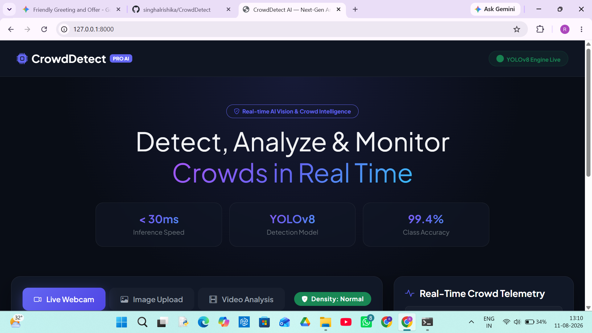
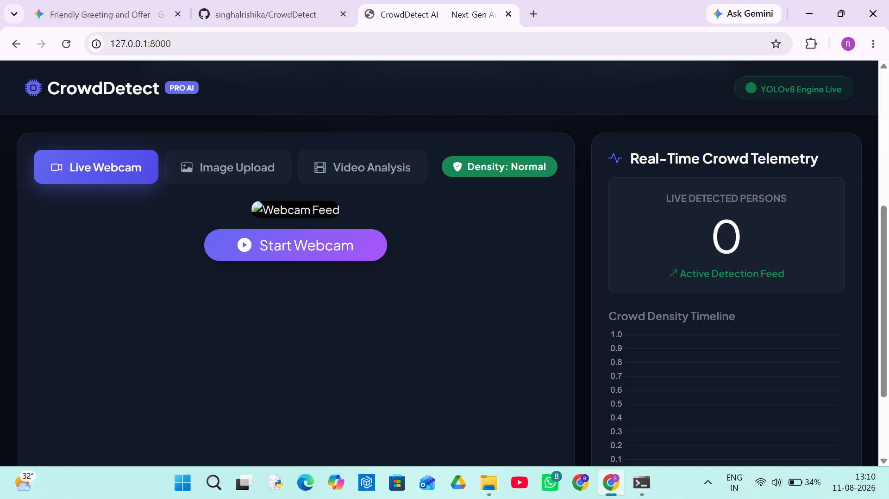
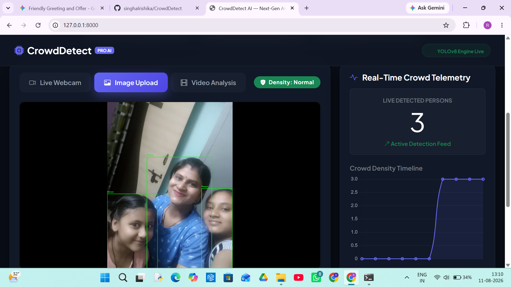
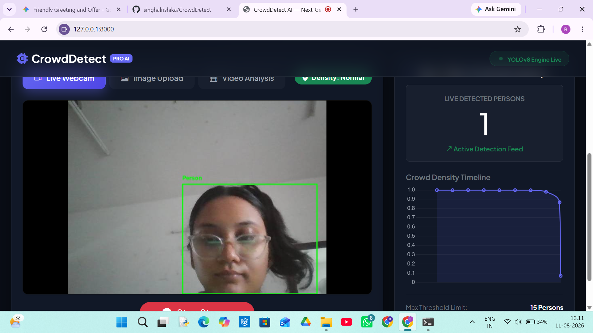

# 🚨 CrowdDetect - Real-Time Crowd Detection System

A computer vision application built with **YOLOv8** and **Python** designed to detect and monitor crowds in real-time. This system processes images and video feeds to identify people and analyze crowd density for safety and management applications.

## 📌 Features

- **Real-Time Detection:** Powered by Ultralytics YOLOv8 for accurate object detection.
- **Web Interface:** Interactive web dashboard for viewing detection results.
- **Lightweight Model:** Uses `yolov8n.pt` for efficient object detection.
- **Image Detection:** Upload images and detect people using YOLOv8.
- **Video Detection:** Process video files for crowd analysis.
- **Crowd Analysis:** Helps monitor the number of people detected in a scene.
- **Scalable Architecture:** Can be extended for CCTV streams and webcam-based applications.

## 🛠️ Tech Stack

- **Python**
- **FastAPI**
- **YOLOv8 / Ultralytics**
- **OpenCV**
- **HTML**
- **CSS**
- **JavaScript**

## 📂 Project Structure

```text
CrowdDetect/
│
├── assets/
│   ├── shot1.png
│   ├── shot2.png
│   ├── shot3.png
│   └── shot4.png
│
├── templates/
│   └── index.html
│
├── main.py
├── yolov8n.pt
├── requirements.txt
├── .gitignore
└── README.md
```

## ⚙️ Installation & Setup

Follow these steps to run the project locally.

### 1. Clone the Repository

```bash
git clone https://github.com/singhalrishika/CrowdDetect.git
cd CrowdDetect
```

### 2. Create a Virtual Environment

For Windows:

```bash
python -m venv venv
```

Activate the virtual environment:

```bash
venv\Scripts\activate
```

### 3. Install Dependencies

```bash
pip install -r requirements.txt
```

### 4. Run the Application

Start the FastAPI server using Uvicorn:

```bash
uvicorn main:app --reload
```

### 5. Access the Application

Open your browser and visit:

```text
http://127.0.0.1:8000/
```

## 🚀 Live Demo

[](https://crowddetect.onrender.com)

👉 **[Open CrowdDetect Live Demo](https://crowddetect.onrender.com)**

## 📸 Screenshots

### Dashboard



### Detection Interface



### Crowd Detection



### Results



## 🤝 Contributing

Contributions are welcome!

Feel free to open an issue or submit a pull request to improve the crowd detection system, user interface, or performance.

## 📄 License

This project is intended for educational and demonstration purposes.
